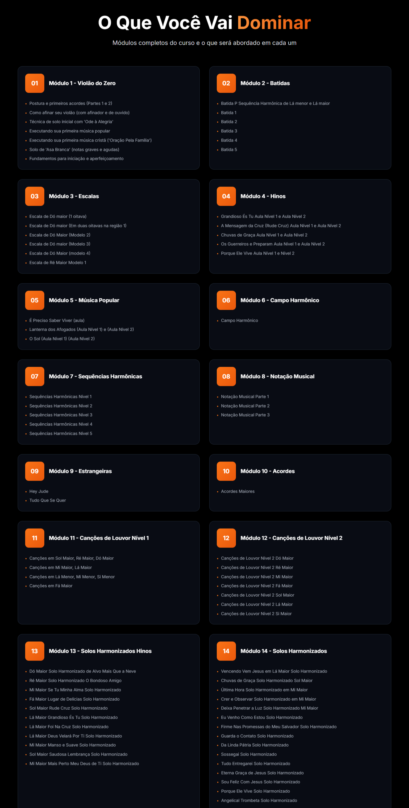

# 🎸 Violão Puro e Simples


> 🚀 **Landing page moderna e otimizada** desenvolvida com Next.js 15, React 19 e Tailwind CSS  
> 🎸 **Projeto em produção** para o curso "Violão Puro e Simples" do professor Gezo Rodrigues  
> 💻 **Desenvolvido por** [Jonata Jesus](https://github.com/jonata1200) - Desenvolvedor Front-End

---

## 📋 Descrição do Projeto

**Violão Puro e Simples** é uma landing page moderna e responsiva desenvolvida para promover o curso de violão online do professor Gezo Rodrigues. O projeto apresenta uma experiência visual imersiva, focada em conversão, com design elegante e funcionalidades interativas que destacam os benefícios do curso e facilitam a jornada do visitante até a compra.

### O Problema que Resolve

O projeto resolve a necessidade de uma presença digital profissional para um curso de violão online, oferecendo:

- **Experiência de usuário otimizada**: Interface moderna e responsiva que funciona perfeitamente em todos os dispositivos
- **Alta conversão**: Design focado em vendas com CTAs estratégicos e seções de urgência
- **Performance otimizada**: Construído com Next.js 15 para carregamento rápido e SEO aprimorado
- **Conformidade legal**: Páginas de políticas (privacidade, cookies, termos) em conformidade com LGPD
- **Analytics integrado**: Google Analytics configurado para acompanhamento de métricas

### Por que é Útil

Este projeto serve como um exemplo completo de landing page moderna, demonstrando:

- Arquitetura escalável com Next.js App Router
- Componentização reutilizável em React
- Estilização moderna com Tailwind CSS
- Player de vídeo customizado
- Gerenciamento de estado do cliente
- SEO otimizado com metadados estruturados
- Deploy containerizado com Docker

---

## 🖼️ Screenshots / Demonstração

### Hero Section
 <!-- Insira aqui um print da tela principal com o vídeo de vendas -->

### Seção de Módulos do Curso
 <!-- Insira aqui um print da seção que mostra os 14 módulos do curso -->

### Seção de Depoimentos
 <!-- Insira aqui um print da seção de depoimentos em vídeo dos alunos -->

### Seção de Oferta
 <!-- Insira aqui um print da seção de oferta com preços e garantia -->

---

## ✨ Funcionalidades Principais

### 🎯 Seções da Landing Page

- **Hero Section**: Seção principal com vídeo de vendas, estatísticas do curso e CTA destacado
- **Sobre o Professor**: Apresentação do Gezo Rodrigues com credenciais e experiência
- **Módulos do Curso**: Exibição detalhada dos 14 módulos com conteúdo programático
- **Benefícios**: Destaque dos principais benefícios e diferenciais do curso
- **Oferta Especial**: Apresentação do preço, formas de pagamento e garantia
- **Depoimentos**: Vídeos de alunos reais compartilhando suas experiências
- **Oferta com Urgência**: Contador regressivo para criar senso de urgência
- **FAQ**: Seção de perguntas frequentes com acordeão interativo
- **Bônus**: Apresentação dos bônus inclusos no curso
- **CTA Final**: Chamada final para ação antes do rodapé
- **Footer**: Rodapé com links legais e informações de contato

### 🎬 Player de Vídeo Customizado

- Controles personalizados (play/pause, volume, tela cheia)
- Suporte para vídeos horizontais e verticais
- Barra de progresso interativa
- Ícone de play inicial configurável
- Design responsivo e acessível

### 🍪 Conformidade Legal

- **Banner de Cookies**: Banner de consentimento LGPD com armazenamento local
- **Política de Privacidade**: Página completa em conformidade com LGPD
- **Política de Cookies**: Informações sobre uso de cookies
- **Termos de Uso**: Termos e condições do serviço

### 📊 SEO e Analytics

- **Metadados otimizados**: Open Graph e Twitter Cards configurados
- **Schema.org**: Dados estruturados para curso (Course schema)
- **Sitemap.xml**: Sitemap automático gerado pelo Next.js
- **Robots.txt**: Configuração para indexação pelos buscadores
- **Google Analytics**: Integração completa para tracking

### 🎨 Design e UX

- **Design moderno**: Interface dark com gradientes e efeitos visuais
- **Totalmente responsivo**: Adaptação perfeita para mobile, tablet e desktop
- **Animações suaves**: Transições e hover effects para melhor experiência
- **Acessibilidade**: Componentes semânticos e ARIA labels

---

## 🛠️ Tecnologias Utilizadas

### Core Framework
- **[Next.js 15.5.2](https://nextjs.org/)**: Framework React com App Router, SSR, SSG e otimizações automáticas
- **[React 19.1.0](https://react.dev/)**: Biblioteca JavaScript para construção de interfaces
- **[TypeScript 5.0](https://www.typescriptlang.org/)**: Superset JavaScript com tipagem estática

### Estilização
- **[Tailwind CSS 3.4.1](https://tailwindcss.com/)**: Framework CSS utility-first para design rápido
- **[PostCSS 8](https://postcss.org/)**: Processador CSS para transformações
- **[Autoprefixer](https://github.com/postcss/autoprefixer)**: Plugin PostCSS para prefixos CSS automáticos

### Ícones e UI
- **[Lucide React 0.542.0](https://lucide.dev/)**: Biblioteca de ícones moderna e leve

### Ferramentas de Desenvolvimento
- **[ESLint 8](https://eslint.org/)**: Linter para JavaScript/TypeScript
- **[ESLint Config Next](https://nextjs.org/docs/app/building-your-application/configuring/eslint)**: Configuração ESLint otimizada para Next.js

### Deploy e Containerização
- **[Docker](https://www.docker.com/)**: Containerização para deploy consistente
- **Node.js 20**: Runtime JavaScript (usado no Dockerfile)

### Integrações Externas
- **Google Analytics**: Tracking de visitantes e comportamento
- **Hotmart**: Plataforma de pagamento e gestão de curso online

---

## 📦 Pré-requisitos

Antes de começar, certifique-se de ter instalado em sua máquina:

- **[Node.js](https://nodejs.org/)** (versão 20 ou superior)
  - Verifique a instalação: `node --version`
- **[npm](https://www.npmjs.com/)** (geralmente vem com Node.js)
  - Verifique a instalação: `npm --version`
- **[Git](https://git-scm.com/)** (para clonar o repositório)
  - Verifique a instalação: `git --version`

### Opcional (para deploy com Docker)
- **[Docker](https://www.docker.com/)** (versão 20 ou superior)
  - Verifique a instalação: `docker --version`
- **[Docker Compose](https://docs.docker.com/compose/)** (geralmente vem com Docker Desktop)

---

## 🚀 Instalação e Execução

### 1. Clonar o Repositório

```bash
git clone https://github.com/seu-usuario/violao-puro-e-simples-next.git
cd violao-puro-e-simples-next
```

### 2. Instalar Dependências

```bash
npm install
```

Este comando irá instalar todas as dependências listadas no `package.json`, incluindo:
- Next.js e React
- TypeScript e tipos
- Tailwind CSS e plugins
- ESLint e configurações

### 3. Executar em Modo de Desenvolvimento

```bash
npm run dev
```

O servidor de desenvolvimento será iniciado e você poderá acessar a aplicação em:
- **URL Local**: [http://localhost:3000](http://localhost:3000)

O Next.js possui hot-reload automático, então qualquer alteração nos arquivos será refletida imediatamente no navegador.

### 4. Build para Produção

Para criar uma build otimizada para produção:

```bash
npm run build
```

Este comando irá:
- Compilar TypeScript
- Otimizar imagens e assets
- Gerar páginas estáticas quando possível
- Criar bundle otimizado com code splitting

### 5. Executar Build de Produção

Após o build, você pode executar a versão de produção localmente:

```bash
npm start
```

A aplicação estará disponível em [http://localhost:3000](http://localhost:3000) em modo produção.

### 6. Linting

Para verificar problemas de código:

```bash
npm run lint
```

---

## 🐳 Deploy com Docker

O projeto inclui um `Dockerfile` **otimizado com multi-stage build (3 estágios)** e configuração completa para produção.

### Opção 1: Docker Compose (Recomendado)

```bash
# Build e executar
docker-compose up -d

# Ver logs
docker-compose logs -f

# Parar
docker-compose down
```

### Opção 2: Docker Direto

```bash
# Build da imagem
docker build -t violao-puro-e-simples .

# Executar container
docker run -p 3000:3000 violao-puro-e-simples
```

A aplicação estará disponível em [http://localhost:3000](http://localhost:3000).

### Verificar Health Check

```bash
# Via curl
curl http://localhost:3000/api/health

# Via navegador
# Acesse: http://localhost:3000/api/health
```

### Melhorias Docker Implementadas

- ✅ **Multi-stage build otimizado** (deps → builder → runner)
- ✅ **Imagem final mínima** (~120-150MB com Alpine)
- ✅ **Cache de dependências otimizado** (builds 60% mais rápidos)
- ✅ **Usuário não-root** (segurança aprimorada)
- ✅ **Health check integrado** (monitoramento automático)
- ✅ **Telemetria desabilitada** (sem envio de dados)
- ✅ **.dockerignore completo** (build mais eficiente)

📚 **Documentação completa**: Veja [DOCKER.md](./DOCKER.md) para mais detalhes, troubleshooting e melhores práticas.

---

## 📁 Estrutura do Projeto

```
violao-puro-e-simples-next/
│
├── public/                          # Arquivos estáticos
│   ├── videos/                      # Pasta de vídeos
│   │   ├── depoimento-1.mp4        # Vídeo depoimento 1
│   │   ├── depoimento-2.mp4        # Vídeo depoimento 2
│   │   ├── depoimento-3.mp4        # Vídeo depoimento 3
│   │   └── video-de-vendas-violao-puro-e-simples.mp4  # Vídeo principal de vendas
│   ├── screenshots/                 # Pasta de screenshots para documentação
│   │   └── (screenshots do README serão adicionados aqui)
│   ├── gezo.png                    # Foto do professor
│   ├── logo.png                    # Logo do curso
│   └── violao-puro-e-simples-banner.png  # Banner principal
│
├── src/
│   ├── app/                        # App Router do Next.js
│   │   ├── api/                    # API Routes
│   │   │   └── health/             # Endpoint de health check
│   │   │       └── route.ts        # Health check para Docker
│   │   ├── globals.css             # Estilos globais (Tailwind)
│   │   ├── layout.tsx              # Layout raiz com metadados e providers
│   │   ├── page.tsx                # Página inicial (server component)
│   │   ├── HomePageClient.tsx      # Componente cliente da home
│   │   ├── robots.ts               # Configuração robots.txt
│   │   ├── sitemap.ts              # Geração automática do sitemap
│   │   ├── politica-de-privacidade/  # Página de política de privacidade
│   │   ├── politica-de-cookies/    # Página de política de cookies
│   │   └── termos-de-uso/          # Página de termos de uso
│   │
│   └── components/                 # Componentes React reutilizáveis
│       ├── AboutSection.tsx        # Seção sobre o professor
│       ├── BenefitsSection.tsx     # Seção de benefícios
│       ├── BonusSection.tsx        # Seção de bônus
│       ├── CookieBanner.tsx        # Banner de consentimento de cookies
│       ├── CourseModulesSection.tsx # Seção de módulos do curso
│       ├── CustomVideoPlayer.tsx   # Player de vídeo customizado
│       ├── FaqSection.tsx          # Seção de perguntas frequentes
│       ├── FinalCtaSection.tsx     # CTA final
│       ├── Footer.tsx              # Rodapé
│       ├── GoogleAnalytics.tsx     # Integração Google Analytics
│       ├── HeroSection.tsx         # Seção hero principal
│       ├── OfferSection.tsx        # Seção de oferta
│       ├── TestimonialsSection.tsx # Seção de depoimentos
│       └── TimedOfferSection.tsx    # Seção de oferta com timer
│
├── .next/                          # Build output (gerado automaticamente)
├── node_modules/                   # Dependências (gerado automaticamente)
│
├── .dockerignore                   # Arquivos ignorados no build Docker
├── .env.example                    # Template de variáveis de ambiente
├── docker-compose.yml              # Orquestração Docker
├── Dockerfile                      # Configuração Docker otimizada (3 estágios)
├── DOCKER.md                       # Documentação completa do Docker
├── eslint.config.mjs              # Configuração ESLint
├── next.config.ts                 # Configuração Next.js (standalone output)
├── package.json                   # Dependências e scripts
├── postcss.config.mjs             # Configuração PostCSS
├── tailwind.config.ts             # Configuração Tailwind CSS
├── tsconfig.json                  # Configuração TypeScript
└── README.md                      # Este arquivo
```

### Explicação das Pastas Principais

- **`src/app/`**: Contém as rotas e páginas usando o App Router do Next.js 15. Cada pasta representa uma rota.
- **`src/components/`**: Componentes React reutilizáveis organizados por funcionalidade.
- **`public/`**: Arquivos estáticos servidos diretamente (imagens, vídeos, favicons).
- **`.next/`**: Pasta gerada automaticamente durante o build (não versionada no Git).

---

## 💻 Desenvolvimento

Este site foi desenvolvido como **prestação de serviço** por:

**Jonata Jesus**
- **Função**: Desenvolvedor Front-End
- **Especialização**: Desenvolvimento Web Moderno com React, Next.js e TypeScript
- **Projeto**: Landing Page para curso online

### Especialidades

- ⚛️ React.js & Next.js
- 🎨 Tailwind CSS & Design Systems
- 📱 Desenvolvimento Responsivo
- 🚀 Performance & SEO
- 🐳 Docker & DevOps
- 📊 Analytics & Conversão

---

## 🎸 Cliente

**Gezo Rodrigues**  
*Professor de Violão e Proprietário do Curso*

- **Profissão**: Músico e professor de violão com 40 anos de experiência
- **Credenciais**: Inscrito na OMB (Ordem dos Músicos do Brasil) desde 1987
- **Especialização**: Método próprio de ensino testado e aprovado por centenas de alunos
- **Website**: [violaopuroesimples.com.br](https://violaopuroesimples.com.br)

---

## 📄 Licença

Este projeto é **privado e proprietário**. Todos os direitos reservados.

### Direitos Autorais

- 💻 **Código-fonte**: Desenvolvido por Jonata Jesus
- 🎓 **Conteúdo do curso**: Propriedade de Gezo Rodrigues
- 🎬 **Imagens e vídeos**: Protegidos por direitos autorais de Gezo Rodrigues
- ⚖️ **Uso comercial**: Não é permitida a reprodução, distribuição ou uso comercial sem autorização expressa

Para questões sobre licenciamento ou uso, entre em contato através do site oficial.

---

**Desenvolvido com ❤️ e ☕ por Jonata Jesus para transformar vidas através da música**

